# POE item alert bot for racing

This is a discord bot which enables you to quickly (if the PoE API let's you that is...) filter a load of items for all characters inside of a ladder.

You need to register the league the bot should be working in first:

```
!item-alert set_league "SSF Delirium"
```

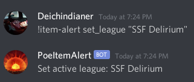

If you're unsure what league is currently active

```
!item-alert get_league
```

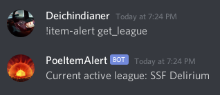

# Race filters

Just a quick list of filters that might be useful for casters :)

* `!item-alert find "type+mod:Boots+Movement Speed"`
* `!item-alert find "type+mod:Flask+Movement Speed"`
* `!item-alert find "links:4" "unique:any"`
* `!item-alert find "type+mod:Flask+Instantly"` - this one can't run on `Life Flask` because of the way I wrote the matching logic currently
* `!item-alert find "unique:Tabula Rasa" "unique:Wanderlust"` - Add all of the ones you want to check for here in one query, it's faster than checking alone because the character is cached between these runs :)

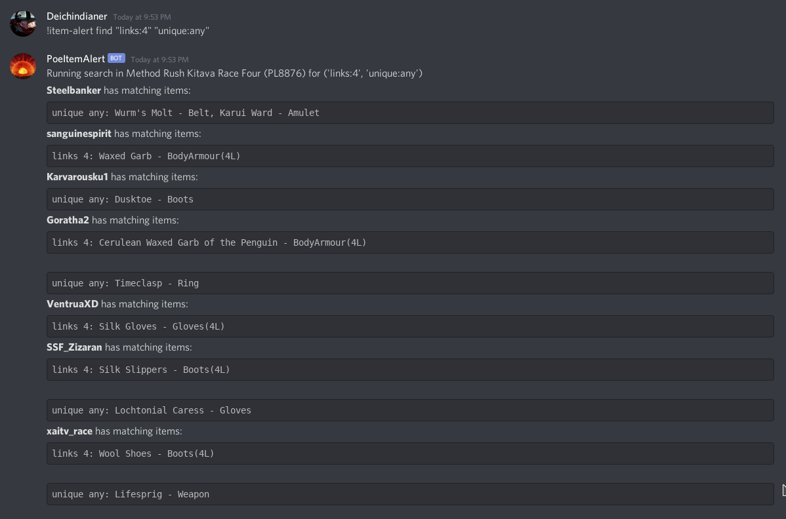

# Filter explanations

Now for the cool stuff the actual cool stuff, finding items!


The basic concept is that you have the `!item-alert find` command as the entrypoint.
Behind that command you can specify filters like `type:Boots` or `mod:Movement Speed`. The bot will take these filters individually and run over all characters and all items in the ladder pinging you back the matches.

A full list of the filters available:

* type
* mod
* links
* unique

## type filters

Very straight forward, can be very generic as just `Boots` or getting more specific to get only specific bases `Chain Belt`.
Not much more to it :)

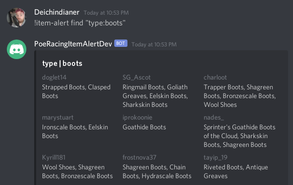


## mod filters

Again not much complexity to it but very powerful! It will check for partial matches so if you run `mod:Resistance` you will get any item back that has a mod with the word `Resistance` in it - so going completely generic is going to spam quite a lot :)

There is a big caveat currently in that the search backend does not handle requests like `mod+mod:Resist+life` and will not respond or respond will bad data. It is being looked at in [this issue](https://github.com/poe-item-alerts/poe-item-search/issues/8).

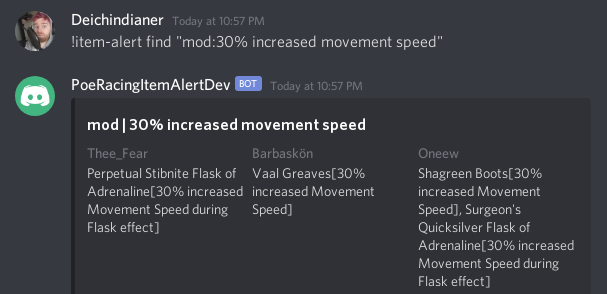

## link filters

This filter counts the number of links on an item and notifies you if the number of links on the item is greater or equal to your filter. Invoke it using `links:4`.

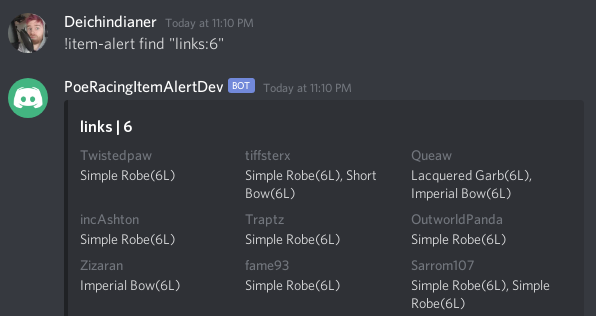

## unique filters

With the unique filters you have two possibilities

* Running to filter on any unique `unique:any`
* Filtering for a specific unique `unique:Crown of the Inward Eye`

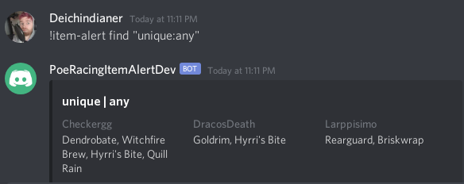
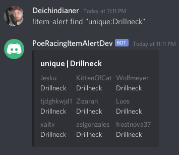

## Combined filters

Here we get to the real magic and why this bot is so powerful! You can combine any number of these filters to create complex queries, just combine the filter types with `+` and the values as well:

* `type+mod:Boots+Movement Speed`
* `type+mod+links:Boots+Movement Speed+4`

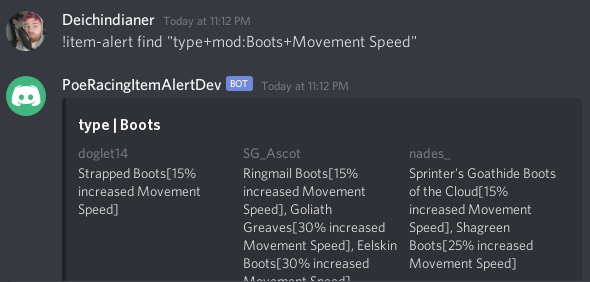
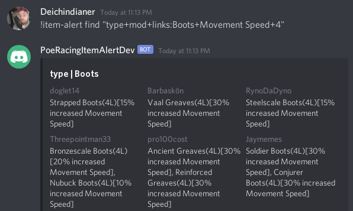

## Multiple filters in one go

To reduce waiting time on the API (I wish it was less evil to me :( ) it is possible to ask the bot multiple questions at the same time, and you should do that!

* `!item-alert find "type+mod+links:Boots+Movement Speed+4" "unique:any" "type+links:Armour+6"`

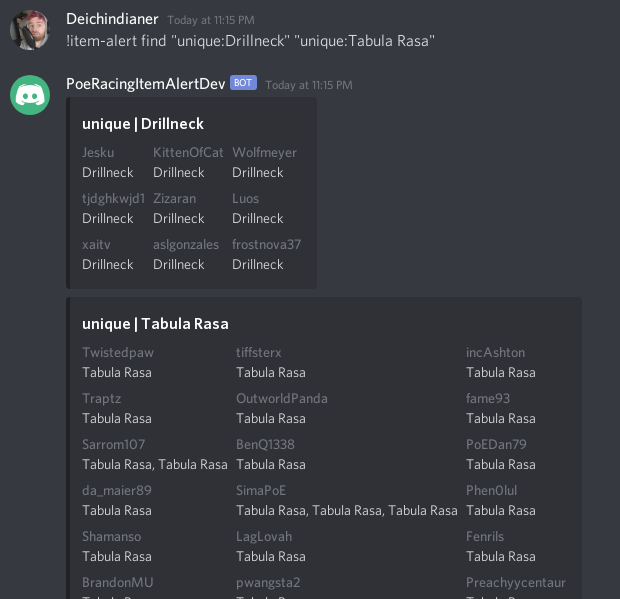

